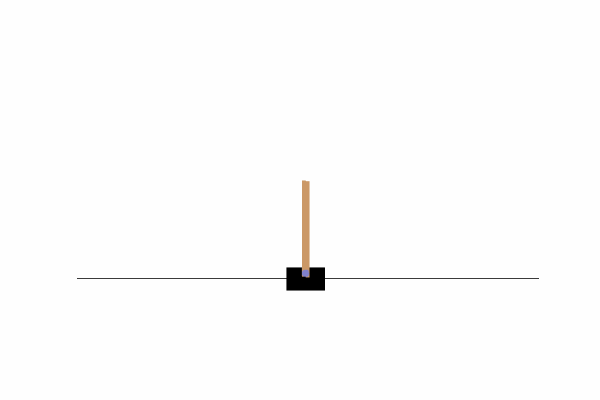

# Reinforement Learning

Some RL learning algorithms based on the lecture Probabilistic Artificial Intelligence by Prof. Dr. Andreas Krause.

Right now there is only an implementation of the Deep Q-learning alorithm here, but more will follow soon.

While you can find many implementations of this algorithm online, they are often overloaded with features making them more versatile, but also hindering their readability for a beginner. Here I have tried to stick with the bare minimum needed for training the clasic 'Cart-Pole' environment from the OpenAi gym package. 

There are 3 key classes here:
* Q_net
* Buffer
* DQNAgent

The Q-net implements a very simple neural network, that the agent uses to learn the Action-value function. The Buffer is used to store epsiodes of the agents experience. The agent then interacts with the environment. It always plays the greedy action, maximizing the current Q-function, until the game terminates, then the neural neutwork is updated. 

For the target in Q-learning we need to store the parametes of the old Q-function. We then update the old Q-net very target_update steps. 

# Results: 
I have not tried to optimize all parameters perfectly since this was only for educational purpose, but here are my results: 

